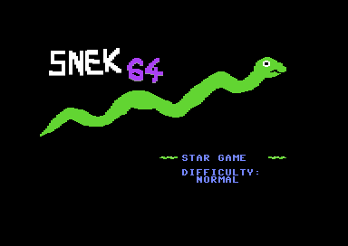

# snek64

Snek64 is my first C64 program, made as I was learning. It has a side effect of being actually fun game.

## Gameplay

It's Snake. You all know Snake. The unique gameplay twist is that every time you eat food, your snake changes colour. More colours you have on your screen, the higher goes the multiplier, which encourages player to grab food fast and play more aggresively.

## Features and techniques

This is educational project, so it has quite a variety, made just for the sake of it. Listing in order of difficulty I had writing that:

- Text mode graphics with some nice colors
- Joystic input
- Raster interrupts
- Neat implementation of double-ended queue up to 255 elements (6502 is really nice at it)
- Decimal numbers and printing them
- Sprites (used in menu)
- Bitmap graphics
- Self-modifying code
- Mid-frame VIC-II reprogramming (what a fun thing)

Loads of macros and other nice features of Kick Assembler, yeah that's the thing.

### Missing stuff

By now I consider the game to be feature-complete. Things that aren't present in the final version are:

- Sound effects
- Music
- Zero-page variables of any kind (yeah I just couldn't get them to work for some reason)

Maybe the next time.

### File structure & code quality

It could be better. Menu routines are kinda mess and I'm sure they can be cleaned up with smart use of macros. Still looks quite all right for a first project.

## Build

Change the `ASM` value in the makefile to `java -jar /path/to/kickass/KickAss.jar` and go for `make`. If you have VICE installed, `make emulate` launches stuff.

## Tools used

- [Kick Assembler](https://www.theweb.dk/KickAssembler/) for code
- [spritemate](https://www.spritemate.com/) for sprites
- [multipaint](http://multipaint.kameli.net/) for artwork
- VS Code with [KickAss plugin](https://marketplace.visualstudio.com/items?itemName=CaptainJiNX.kickass-c64)
- [VICE](https://vice-emu.sourceforge.io/) for testing before hitting the real hardware
- [Pi1541](https://cbm-pi1541.firebaseapp.com/) for testing on my C64

## Resources I found helpful

- [Course by board-b](https://www.youtube.com/watch?v=rFOh_lYcF8A&list=PLU1o_YShTPgoA7_nZ0PutqaPDsitA5RvV) I really recommend
- Joe Forster's [memory map](https://sta.c64.org/cbm64mem.html) (absolute lifesaver)
- mass:werk [opcode reference](https://www.masswerk.at/6502/6502_instruction_set.html) for 6502 
- [6502.org](6502.org) for some nice extra tutorials
- [codebase64.org](codebase64.org) which made hacking great again
